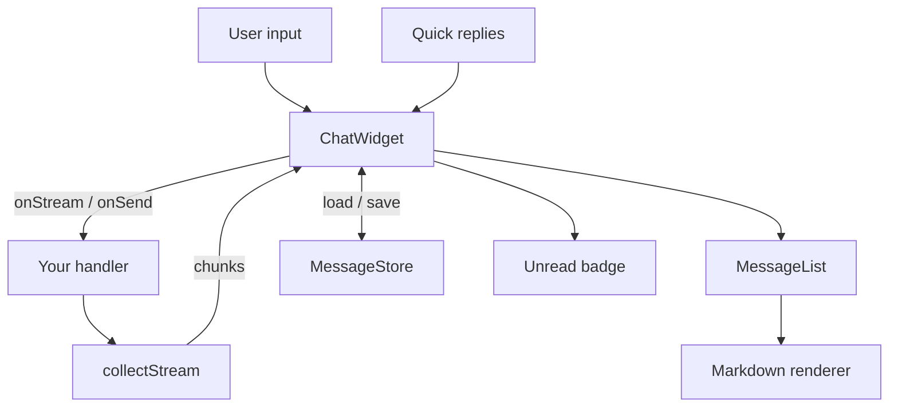

<div align="center">
  
</div>

<h1 align="center">chatbot-widget</h1>

<p align="center"><strong>A tiny, strict-typed, embeddable React chatbot widget with streaming, persistence, quick replies, theming, and markdown-safe rendering.</strong></p>

<p align="center"><em>Built and maintained by Viprasol Tech.</em></p>

<p align="center">
  <a href="https://github.com/Viprasol-Tech/chatbot-widget/actions"></a>
  <a href="LICENSE"></a>
  <a href="https://www.typescriptlang.org/"></a>
  <a href="https://react.dev/"></a>
  
  
</p>

A drop-in React chatbot widget: a floating launcher that toggles a chat panel with a live message list, input, quick replies, an animated typing indicator, an unread badge, theming, and pluggable persistence. Sending is fully pluggable — wire it to any backend, LLM, or canned-reply bot. Bot replies can **stream** token-by-token and are rendered through a **markdown-safe** parser that never injects raw HTML.

---

## Features

- **Floating launcher + panel** — accessible (`role="dialog"`, ARIA labels), keyboard-friendly input.
- **Streaming responses** — supply an async generator (`onStream`); replies grow live as chunks arrive.
- **Typing indicator** — animated three-dot bubble while the bot composes.
- **Pluggable persistence** — `MessageStore` interface with `MemoryStore` and `WebStorageStore` adapters.
- **Quick-reply buttons** — tappable chips that submit a value as if typed.
- **Unread badge** — counts bot replies that arrive while the panel is closed.
- **Theming** — light/dark presets plus full CSS-variable overrides.
- **Markdown-safe rendering** — bold, italic, code, fenced blocks, and scheme-filtered links; no raw HTML, no `javascript:` URLs.
- **Strict TypeScript** — every export typed; zero runtime dependencies beyond React.

## Install

```bash
npm install chatbot-widget
# react and react-dom are peer dependencies (>=18)
```

## Quickstart

```tsx
import { ChatWidget } from "chatbot-widget";

export function App() {
  return (
    <ChatWidget
      title="Support"
      defaultOpen
      onSend={async (text) => `You said: ${text}`}
    />
  );
}
```

## Usage

### Streaming replies (LLM-style)

```tsx
import { ChatWidget } from "chatbot-widget";

async function* streamReply(text: string) {
  const res = await fetch("/api/chat", { method: "POST", body: text });
  const reader = res.body!.getReader();
  const decoder = new TextDecoder();
  for (;;) {
    const { value, done } = await reader.read();
    if (done) break;
    yield decoder.decode(value, { stream: true });
  }
}

<ChatWidget onStream={streamReply} title="Ask AI" />;
```

### Persistence, quick replies, and a dark theme

```tsx
import { ChatWidget, WebStorageStore, darkTheme } from "chatbot-widget";

const store = new WebStorageStore("support:transcript");

<ChatWidget
  onSend={myHandler}
  store={store}
  theme={darkTheme}
  initialQuickReplies={[
    { id: "price", label: "Pricing", value: "Tell me about pricing" },
    { id: "demo", label: "Book a demo" },
  ]}
  onUnreadChange={(n) => console.log(`${n} unread`)}
/>;
```

### Custom theme

```tsx
<ChatWidget
  onSend={myHandler}
  theme={{ primary: "#10b981", radius: 16, surface: "#0b1120", onSurface: "#e2e8f0" }}
/>
```

## API

### `<ChatWidget />` props

| Prop                  | Type                              | Default             | Description                                        |
| --------------------- | --------------------------------- | ------------------- | -------------------------------------------------- |
| `onSend`              | `(text) => Promise<string>`       | —                   | Request/response reply handler.                    |
| `onStream`            | `(text) => AsyncIterable<string>` | —                   | Streaming handler; takes precedence over `onSend`. |
| `title`               | `string`                          | `"Chat with us"`    | Panel header title.                                |
| `defaultOpen`         | `boolean`                         | `false`             | Whether the panel starts open.                     |
| `initialMessages`     | `ChatMessage[]`                   | `[]`                | Seed transcript (ignored if a store loads state).  |
| `initialQuickReplies` | `QuickReply[]`                    | `[]`                | Quick-reply chips shown initially.                 |
| `placeholder`         | `string`                          | `"Type a message…"` | Input placeholder.                                 |
| `store`               | `MessageStore`                    | —                   | Pluggable persistence layer.                       |
| `theme`               | `ChatTheme`                       | `defaultTheme`      | Visual theme overrides.                            |
| `markdown`            | `boolean`                         | `true`              | Render bot bodies as markdown.                     |
| `onUnreadChange`      | `(count: number) => void`         | —                   | Called when the unread badge count changes.        |

### Notable exports

| Export                                           | Kind      | Purpose                         |
| ------------------------------------------------ | --------- | ------------------------------- |
| `ChatWidget`, `MessageList`, `ChatInput`         | component | Core UI building blocks.        |
| `QuickReplies`, `Markdown`, `TypingIndicator`    | component | Composable pieces.              |
| `MemoryStore`, `WebStorageStore`                 | class     | `MessageStore` implementations. |
| `collectStream`, `toStreamHandler`, `fakeStream` | fn        | Streaming helpers.              |
| `parseMarkdown`, `escapeHtml`, `isSafeHref`      | fn        | Markdown-safe primitives.       |
| `defaultTheme`, `darkTheme`, `themeToCssVars`    | theme     | Theming utilities.              |
| `appendMessage`, `updateMessage`, `countUnread`  | fn        | Transcript helpers.             |

## Architecture



## Roadmap

- [x] Streaming responses (async generator)
- [x] Typing indicator
- [x] Pluggable message persistence
- [x] Quick-reply buttons
- [x] Theming (light/dark + CSS vars)
- [x] Unread badge
- [x] Markdown-safe rendering
- [ ] File / image attachments
- [ ] Read receipts and delivery ticks
- [ ] i18n string bundles
- [ ] Headless hook (`useChat`) for fully custom UIs

## FAQ

**Does it ship a backend?** No — you bring the brains via `onSend` or `onStream`. The widget is pure UI + state.

**Is markdown rendering safe?** Yes. Content is tokenised and rendered through React (which escapes text), links are scheme-filtered (`http`/`https`/`mailto` only), and `dangerouslySetInnerHTML` is never used.

**Where are messages stored?** Wherever your `MessageStore` puts them. `WebStorageStore` uses `localStorage` by default; `MemoryStore` keeps them in memory. Implement the interface for IndexedDB or a server.

**Does it bundle CSS?** Class names (`cw-*`) and CSS custom properties are provided; style them in your app, or pass a `theme` for the variables.

## Contributing

Contributions are welcome. Fork, create a feature branch, run `npm install`, and make sure `npm run typecheck` and `npm test` are green before opening a PR. See [CONTRIBUTING.md](CONTRIBUTING.md) and [CODE_OF_CONDUCT.md](CODE_OF_CONDUCT.md).

## Contact — Viprasol Tech Private Limited

- Website: [viprasol.com](https://viprasol.com)
- Email: [support@viprasol.com](mailto:support@viprasol.com)
- Telegram: [t.me/viprasol_help](https://t.me/viprasol_help) | WhatsApp: +91 96336 52112
- GitHub: [@Viprasol-Tech](https://github.com/Viprasol-Tech) | [LinkedIn](https://www.linkedin.com/in/viprasol/) | X [@viprasol](https://twitter.com/viprasol)

## License

[MIT](LICENSE) (c) 2025 Viprasol Tech Private Limited
